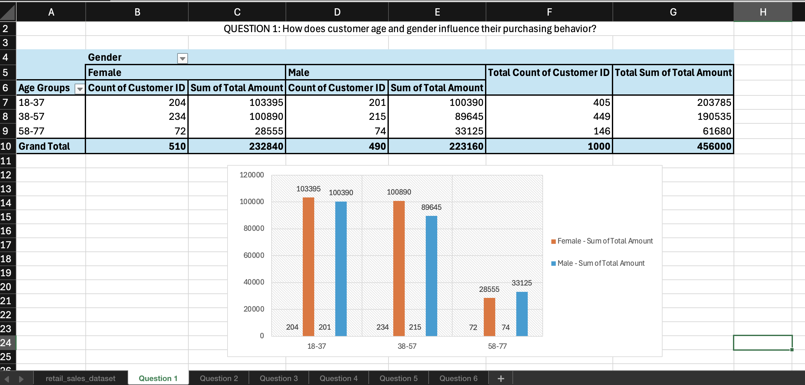
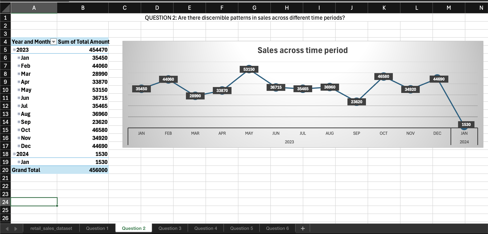
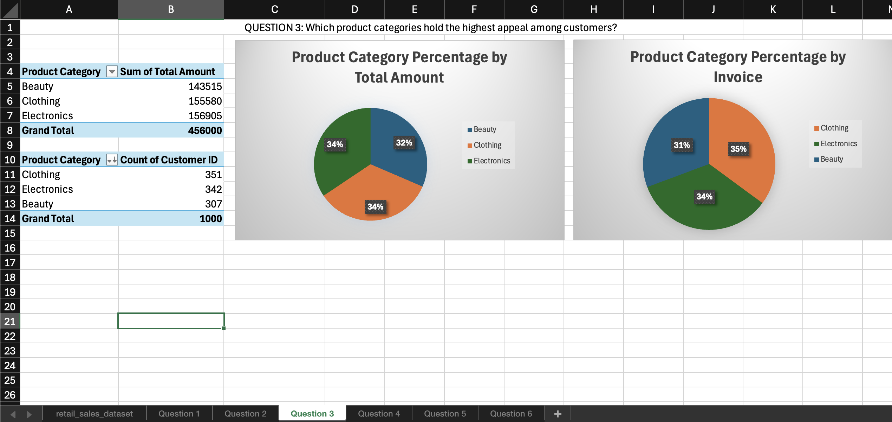
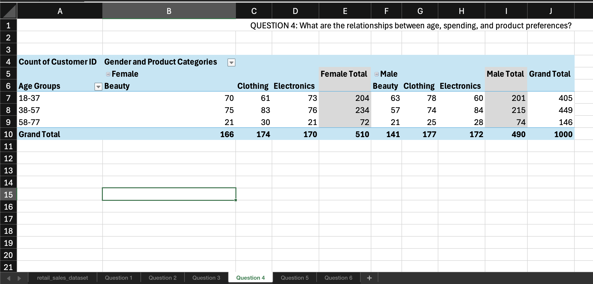
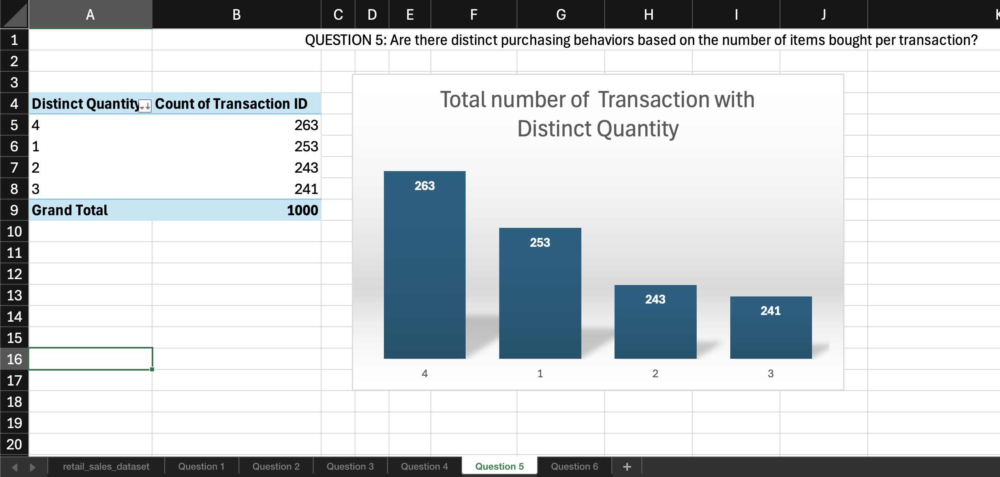
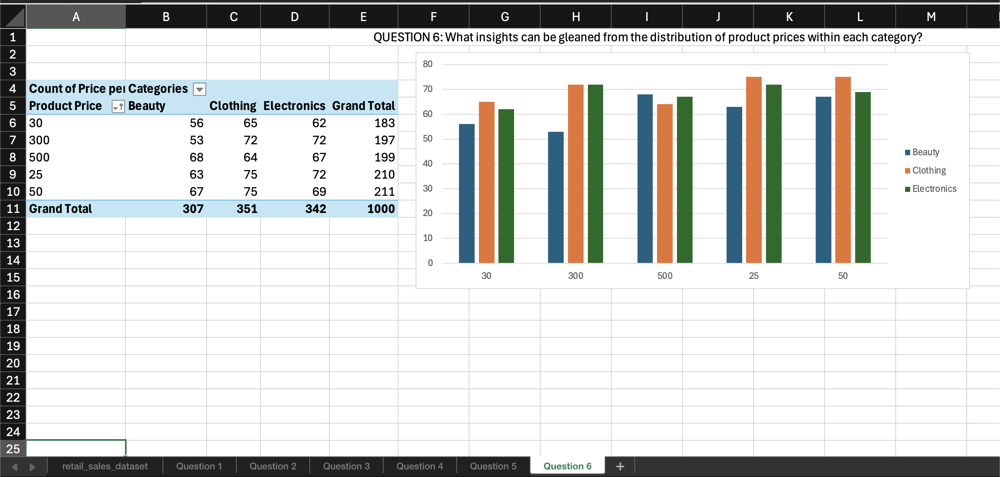

# **Retail Sales and Customer Demographics Analysis**

## **Overview**

This project focuses on exploring and analyzing a synthetic retail dataset to uncover sales patterns, customer profiles, and trends over time. By leveraging Excel for data cleaning, visualization, and statistical analysis, the study aims to provide insights into customer behavior, product preferences, and sales trends in the retail environment.

## **Dataset**

The dataset is a simulated retail sales dataset that captures essential attributes related to transactions and customer demographics. The dataset includes the following columns:

- **Transaction ID**: Unique identifier for each transaction
- **Date**: Date of the transaction
- **Customer ID**: Unique identifier for each customer
- **Gender**: Gender of the customer
- **Age**: Age of the customer
- **Product Category**: Category of the purchased product
- **Quantity**: Number of units purchased
- **Price per Unit**: Price of each unit purchased
- **Total Amount**: Total value of the transaction (calculated as Quantity × Price per Unit)

## **Key Questions Explored**

1. **How does customer age and gender influence their purchasing behavior?**
2. **Are there discernible patterns in sales across different time periods?**
3. **Which product categories hold the highest appeal among customers?**
4. **What are the relationships between age, spending, and product preferences?**
5. **Are there distinct purchasing behaviors based on the number of items bought per transaction?**
6. **What insights can be gleaned from the distribution of product prices within each category?**

## **Analysis and Findings**

Using Excel, the dataset was analyzed through various techniques such as:

- **Data Cleaning**: Removal of null values, handling outliers, and ensuring correct data types.
- **Descriptive Statistics**: Summarizing key numerical features such as average age, total sales, and distribution of product prices.
- **Data Visualization**: Charts and graphs were created to identify patterns and trends in customer behavior and sales.

### **Screenshots for Analysis**

Screenshots for the analysis are provided for each key question. You can find them in the **images** folder:

- **Question 1**: How does customer age and gender influence their purchasing behavior?
  - 

- **Question 2**: Are there discernible patterns in sales across different time periods?
  - 

- **Question 3**: Which product categories hold the highest appeal among customers?
  - 

- **Question 4**: What are the relationships between age, spending, and product preferences?
  - 

- **Question 5**: Are there distinct purchasing behaviors based on the number of items bought per transaction?
  - 

- **Question 6**: What insights can be gleaned from the distribution of product prices within each category?
  - 

## **Key Insights**

- **Age and Gender**: 
  - Customers were segmented into three distinct age groups for analysis: **18-37**, **38-57**, and **58-77**. 
  - **18-37 age group**: Showed a preference for fast-moving and affordable product categories, with higher transaction frequencies but smaller basket sizes.
  - **38-57 age group**: Spent more per transaction, with a preference for premium product categories and higher quantities of goods.
  - **58-77 age group**: Demonstrated conservative spending behavior, often purchasing fewer items but with an affinity for premium products.
  - Gender also played a significant role in product preferences, with distinct patterns in purchasing behaviors across different categories.
- **Sales Trends**: Sales peaked during specific months, indicating seasonal shopping trends. This was particularly evident around holidays.
- **Top Categories**: Certain product categories consistently outperformed others in terms of both units sold and total revenue.
- **Spending Behavior**: Customers purchasing multiple items tended to spend significantly more per transaction, with clear correlations between age and specific product preferences.
- **Price Distribution**: Premium categories had higher price variability, but the data showed that even high-priced items had strong sales in certain customer segments.

## **Tools and Methods**

- **Excel**: The entire analysis was conducted using Excel, utilizing the following features:
  - **Pivot Tables**: For grouping and summarizing data by categories such as age, gender, and product types.
  - **Charts and Graphs**: Bar charts, line graphs, scatter plots, and box plots for data visualization.
  - **Statistical Analysis**: Basic summary statistics and correlation analysis to understand relationships between variables.

## **Conclusion**

This project highlights the power of Excel in uncovering key insights from retail data. By answering specific questions about customer behavior and sales trends, businesses can make data-driven decisions to improve marketing strategies, optimize inventory management, and enhance customer experiences.

## **Usage**

Feel free to download and explore the dataset and analysis files. You can modify the Excel sheets to conduct your own analysis or expand upon the current findings.

---

## **Project Files**

- **Retail Sales Dataset.xlsx**: The dataset used for the analysis.
- **Retail Sales Analysis.xlsx**: The Excel workbook containing all analysis, visualizations, and findings.
- **Images Folder**: Contains screenshots for each key question.

## **Contact**

For any questions or feedback, please contact [Your Name] at [your-email@example.com].
